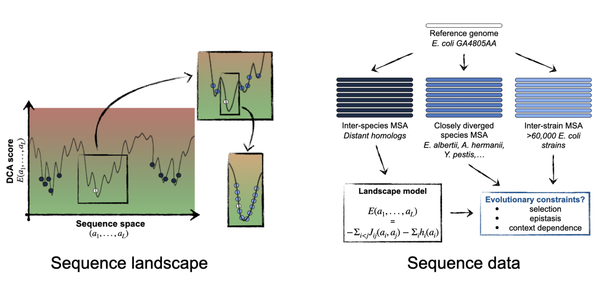

# THIS REPOSITORY IS ARCHIVED 

# You can find an updated version of this repository at: https://github.com/LucileVG/DCA_polymorphism_Ecoli


# DCA to decipher polymorphism in E. coli strains
We use computational models based on Direct Coupling Analysis - [DCA](https://en.wikipedia.org/wiki/Direct_coupling_analysis) - trained on [PFAM](http://pfam.xfam.org/) domains of distant distant homologues to accurately predict the polymorphisms segregating in a panel of 61,157 Escherichia coli genomes. 

We show that the genetic context (i.e. the rest of the protein sequence) strongly constrains the tolerable amino acids in 30% to 50% of amino-acid sites. Our study also suggests the gradual build-up of genetic context over long evolutionary timescales by the accumulation of small epistatic contributions.


Paper: [Deciphering polymorphism in 61,157 Escherichia coli genomes via epistatic sequence landscapes](link to the paper) (Vigué L.\*,  Croce G.\*, and al. Nature Comm., 2021, https://www.nature.com/articles/s41467-022-31643-3)



We provide here the code to reproduce the key results and figures of the paper.

## Installation:
To run the code, you first need to install :
- python3: (the code was tested on python v3.8)
- [julia:](https://julialang.org/)  to run the DCA pseudo-likelihood inference algorithm  (tested on julia v1.6)
- [mafft:](https://mafft.cbrc.jp/alignment/software/) to align sequences (tested on v7.471 (2020/Jul/3))

Then clone the repository to a directory of your choice, where you have writing permissions, and install the python libraries by running:
```
pip install requirements.txt
```
It is strongly recommended to use a virtual environment.
 
You also need to install plmDCA (pseudo-likelihood inference algorithm) for julia (see how to do it from https://github.com/pagnani/PlmDCA)

The typical installation time on a normal computer should be about 15 minutes and should not exceed 45 minutes.


## Config your paths:
Open the file  ```src/config.py``` with your favorite editor, and replace ```path_julia``` with the path to the julia executable on your computer.

## Usage:
Our aim is to train a DCA model on distant homologues (PFAM data - long term evolution - highly variable sequences varibility) and use it to predict polymorphism in E. coli strains (short term evolution - most positions are highly conserved).

## Demo:

Run the following commands to test the demo:

```
./extract_datasets.sh
python3 train_dca_models.py
python3 analyse_coli_strains.py
python3 analyse_closely_diverged_species.py
jupyter lab Produce_Figures.ipynb
```
This should take about 30 minutes to run on a normal computer. It should output the following results:

- ```./extract_datasets.sh``` should untar different archives in a "datasets" folder
- ```python3 train_dca_models.py``` should create a "DCA_models" in the "datasets" folder and fill it with trained DCA models
- ```python3 analyse_coli_strains.py``` ```python3 analyse_closely_diverged_species.py``` should create a "tmp" and a "results" folder. The "tmp" folder will be filled with files used for intermediate computations (can be removed at the end of the analysis). The "results" folder will be filed with the following files: couplings.csv, double_mut_epistasis.csv, full_seq_single_muts.csv, IPR.csv, mutants_sites_ESC_GA4805AA.csv, simulated_sites_ESC_GA4805AA.csv, stats_ESC_GA4805AA.csv. 
- ```jupyter lab Produce_Figures.ipynb``` should allow to analyse the csv files in the "results" folder and generate corresponding figures in a "Figures" folder it creates.


NB1: the demo dataset is provided in order to check that the code is running properly. However to reduce computational time MSAs have been stripped and only a few sites and protein domains are covered (which contradicts a bit the spirit of our work and prevents any robust signal to emerge from data analysis).

NB2: you might need to give the "./extract_datasets.sh" proper permissions in order to execute it (```chmod u+x extract_datasets.sh```).

## Reproduce key results:

To run the code on the real dataset, download data from Zenodo at https://zenodo.org/record/5774192#.YbUZILvjLJE (DOI 10.5281/zenodo.5774191) and put the tar archive in this repository (replace the existing datasets.tar archive which is the demo dataset). Then use following commands to perform data analysis.

```
./extract_datasets.sh
python3 train_dca_models.py
python3 analyse_coli_strains.py
python3 analyse_closely_diverged_species.py
jupyter lab Produce_Figures.ipynb
```
